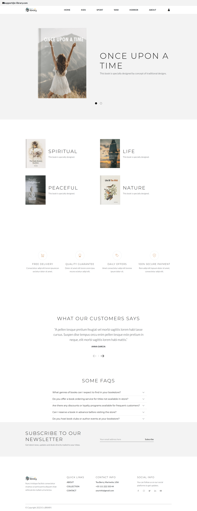

# Online eLibrary Project

This project is a web-based library application built using Django.

## Installation

1. Clone this repository.
2. Create a virtual environment: `python -m venv venv_name`
3. Activate the virtual environment:
   - On Windows: `venv_name\Scripts\activate`
   - On macOS and Linux: `source venv_name/bin/activate`
4. Install dependencies: `pip install -r requirements.txt`
5. Apply database migrations: `python manage.py migrate`
6. Start the development server: `python manage.py runserver`

## Usage

- Access the application via your browser at `http://localhost:8000/`.
- Navigate through the various sections:
  - Home page displays featured books and categories.
  - Users can sign up, sign in, and request book downloads.
  - User profiles show requested book details and status.
  - Admins can approve or reject book requests.

## Contributing

1. Fork the repository.
2. Create a new branch: `git checkout -b feature/new-feature`
3. Commit your changes: `git commit -m 'Add new feature'`
4. Push to the branch: `git push origin feature/new-feature`
5. Submit a pull request.

## Credits

- Django Framework: [Django Documentation](https://docs.djangoproject.com/)
- Bootstrap for styling: [Bootstrap Documentation](https://getbootstrap.com/docs/5.0/getting-started/introduction/)

